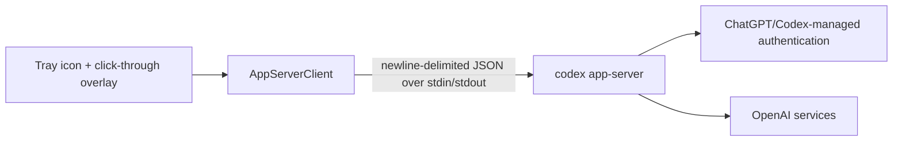

<p align="center">
  
</p>

# Codex Rate Monitor for Windows

[简体中文](README.zh-CN.md) · [繁體中文](README.zh-TW.md) · **English**

A small, native Windows tray utility that displays the current Codex
5-hour and 7-day usage windows next to ChatGPT desktop's Codex UI.

> [!IMPORTANT]
> This is an unofficial community project. It is not affiliated with,
> endorsed by, or supported by OpenAI. The local `codex app-server` protocol
> may change between ChatGPT desktop or Codex versions.

## Quick Start

1. Open ChatGPT desktop, sign in, and switch to the Codex UI you want to
   monitor.
   This monitor only shows ChatGPT account subscription usage windows. API key
   or API-login usage does not expose the 5-hour / 7-day Codex windows and
   cannot be displayed by this tool.
2. Run `CodexRateMonitor.exe` from the extracted release folder. The app has no
   main window; look for its icon in the Windows notification area, including
   the `^` overflow menu.
3. Bring the ChatGPT/Codex window to the foreground. The overlay is shown only
   while that window is active, so it will hide when you switch to another app.
4. Right-click the tray icon. **Appearance settings** is the first item; use it
   to change position, size, colors, opacity, language, and usage display mode.
5. Use **Refresh now** to force a usage read, or select **Top title bar** /
   **Bottom-right** to move the overlay. Double-clicking the tray icon also opens
   Appearance settings.

If nothing appears, first check the tray overflow menu, exit any older monitor
instance, then start this build again and bring ChatGPT/Codex to the foreground.


## Features

- Shows remaining percentage by default, or used percentage when selected.
- Percentage precision can be a whole number or one decimal place.
- Progress length and warning/danger colors follow the selected percentage mode.
- Two overlay positions:
  - bottom-right;
  - centered in the top title bar.
- Lives in the Windows notification area without a console window.
- Click-through overlay: it does not steal focus or block ChatGPT/Codex controls.
- Appearance editor with live preview:
  - font family and sizes;
  - scale, opacity, and corner radius;
  - background, text, progress, warning, and danger colors;
  - light and dark presets.
- Simplified Chinese, Traditional Chinese, and English.
  Language can follow Windows automatically or be selected manually.
- Optional start-with-Windows toggle.
- No direct access to Codex credential files.

## Requirements

- Windows 10 or Windows 11.
- .NET Framework 4.8.
- ChatGPT desktop app with Codex support. The legacy Codex desktop app is
  still supported.
- A native Codex executable with `app-server` support. The monitor first uses
  the executable bundled with the running ChatGPT desktop app, then falls back
  to a standalone Codex CLI on the user's PATH that supports:

  ```powershell
  codex app-server
  ```

- A signed-in ChatGPT/Codex account with rate-limit data available. API key or
  API-login usage cannot provide the 5-hour / 7-day Codex windows this monitor
  displays.
- The user's local environment matters: `codex app-server` must be runnable on
  that machine, and it must be able to see the same signed-in account state as
  ChatGPT desktop or Codex CLI.

## Install

1. Open the repository's **Releases** page.
2. Download `CodexRateMonitor-VERSION-windows-x64.zip`.
3. Verify `SHA256SUMS.txt` if desired.
4. Extract the complete folder to a stable location.
5. Double-click `CodexRateMonitor.exe`.

The application has no main window. Look for its information icon in the
Windows notification area; Windows may initially place it under the `^`
overflow menu.

Release executables are currently unsigned. Windows SmartScreen may show an
unknown-publisher warning. Always download from this repository's Releases
page and verify the checksum or GitHub artifact attestation.

## Use

Right-click the notification-area icon:

| Menu item | Behavior |
|---|---|
| Refresh now | Reads the latest rate-limit snapshot. |
| Reload style | Reloads `settings.json` from disk. |
| Appearance settings | Opens the visual editor and live preview. |
| Top title bar | Uses the compact horizontal overlay. |
| Bottom-right | Uses the larger two-row overlay in the lower-right corner. |
| Start with Windows | Adds/removes a current-user startup registry value. |
| Exit | Stops the monitor and the app-server process it launched. |

Double-click the tray icon to open Appearance settings.

### Language

Open **Appearance settings → Language**:

- Auto (system)
- 简体中文
- 繁體中文
- English

After saving, the tray menu, settings window, overlay labels, status messages,
and date format use the selected language. Reopen Appearance settings to see
the newly selected language throughout that window.

## How it works



The overlay follows the foreground `ChatGPT.exe` desktop window and still
recognizes the legacy `Codex.exe` window. Usage data does not come from screen
scraping or ChatGPT UI internals. It comes from the local Codex CLI app-server
protocol.

The monitor locates a runnable Codex command in this order:

1. ChatGPT desktop's bundled `resources\codex.exe`, when Windows allows it to be
   executed directly.
2. The native executable inside npm/global Codex CLI installs.
3. `codex.exe`, `codex.cmd`, or `codex.ps1` found on the user's PATH.

It then starts:

```text
codex.exe app-server
```

It sends an initialization request, the initialized notification, then:

```json
{"method":"account/rateLimits/read","id":11}
```

The response contains rate-limit windows with fields such as:

- `usedPercent`
- `windowDurationMins`
- `resetsAt`

The monitor renders `primary` as the 5-hour window and `secondary` as the
7-day window. It also accepts sparse
`account/rateLimits/updated` notifications and merges them into the last
snapshot.

The monitor never implements OpenAI authentication. ChatGPT/Codex itself owns
login, token refresh, and network communication.

## Privacy and security

### The application does

- communicate only with a child `codex app-server` over redirected standard
  input/output;
- retain current usage values in memory for display;
- store visual and diagnostic preferences in `settings.json`;
- write redacted diagnostic logs under
  `%LOCALAPPDATA%\CodexRateMonitor\logs`, with automatic retention cleanup;
- optionally write:

  ```text
  HKCU\Software\Microsoft\Windows\CurrentVersion\Run
  ```

### The application does not

- open, parse, copy, upload, or print `auth.json`;
- store access tokens or account identifiers;
- include telemetry or analytics;
- require an OpenAI API key;
- send usage data to a developer-controlled server.

Do not attach `auth.json`, tokens, private account information, or unredacted
desktop screenshots to issues.

See [SECURITY.md](SECURITY.md) for private vulnerability reporting.
Maintainers should also review [PUBLISHING.md](PUBLISHING.md) before making
the repository public.

## Configuration

`settings.json` is created from `config/settings.default.json` in release
packages. It stores display and diagnostic preferences.

Important fields:

| Field | Values |
|---|---|
| `Language` | `auto`, `zh-CN`, `zh-TW`, `en` |
| `Position` | `top` (default), `bottom-right` (`bottom-left` is migrated automatically) |
| `UsageDisplay` | `remaining` (default), `used` |
| `RefreshSeconds` | 30–900 |
| `DiagnosticsEnabled` | `true` (default), `false` |
| `DiagnosticRetentionDays` | 1–30 (default: 7) |
| `Style.Scale` | 0.75–1.50 |
| `Style.Opacity` | 0.50–1.00 |
| `Style.FontSize` | 10–22 |
| `Style.ResetFontSize` | 9–18 |

Colors use `#RRGGBB` or `#RRGGBBAA`.

Runtime `settings.json` is ignored by Git. Only the privacy-safe default
template is committed.

Diagnostic logs contain timestamps, request/notification types, raw rate-limit
percentages, window durations, reset timestamps, parsed values, and redacted
error categories. They never contain complete app-server messages, tokens,
account identifiers, or authentication files. Cleanup runs at startup and at
most once per hour while the monitor is running.

## Build from source

Open PowerShell on Windows:

```powershell
git clone https://github.com/D1NOOO/codex-usage-monitor.git
cd codex-usage-monitor
.\scripts\build.ps1 -Package
```

Output:

```text
artifacts/
├── CodexRateMonitor/
│   ├── CodexRateMonitor.exe
│   ├── settings.json
│   ├── style-examples/
│   └── SHA256SUMS.txt
├── CodexRateMonitor-VERSION-windows-x64.zip
└── SHA256SUMS.txt
```

The build uses the .NET Framework 4.8 compiler included with Windows/Visual
Studio. It does not download NuGet dependencies.

Before compiling, CI runs `scripts/verify.ps1` to check localization
completeness, JSON/PowerShell syntax, accidental runtime settings, personal
paths, and common credential formats.

## Automated Releases

GitHub Actions performs both CI builds and tagged Releases.

1. Update `version.txt`.
2. Commit the change.
3. Create and push a matching semantic-version tag:

   ```powershell
   git tag v0.1.0
   git push origin main
   git push origin v0.1.0
   ```

4. `.github/workflows/release.yml`:
   - verifies the tag matches `version.txt`;
   - builds on `windows-latest`;
   - creates the ZIP and `SHA256SUMS.txt`;
   - generates a GitHub artifact provenance attestation;
   - creates the GitHub Release with generated notes.

The workflow uses the repository-scoped `GITHUB_TOKEN`; no personal access
token is required. The release job receives only `contents: write`,
`id-token: write`, and `attestations: write`.

Official actions are pinned to full commit SHAs. Dependabot checks for action
updates weekly.

To verify provenance after publishing:

```powershell
gh attestation verify CodexRateMonitor-VERSION-windows-x64.zip `
  --repo D1NOOO/codex-usage-monitor
```

## Project layout

```text
src/                    WinForms application and localization tables
assets/                 Application icon
config/                 Privacy-safe default settings
style-examples/         Optional appearance presets
scripts/build.ps1       Reproducible local/CI build
.github/workflows/      CI and Release automation
SECURITY.md             Private vulnerability reporting policy
CONTRIBUTING.md         Contribution guide
```

## Troubleshooting

### `Native Codex executable not found`

Open or update ChatGPT desktop first. If you use a standalone CLI, open a new
PowerShell window and check:

```powershell
codex --version
codex app-server --help
```

Update/install the Codex CLI if `app-server` is unavailable and ChatGPT desktop
is not providing a bundled executable.

`codex app-server --help` only proves that the command exists; it does not read
usage. To diagnose authentication, run:

```powershell
codex doctor
```

If Doctor reports `stored auth mode api_key` or no stored ChatGPT tokens, the
CLI cannot read the 5-hour / 7-day ChatGPT/Codex windows. Sign in with the
ChatGPT account flow in Codex CLI or ChatGPT desktop, then retry.

### `Not signed in`

Open ChatGPT desktop's Codex UI or Codex CLI and sign in normally. The monitor
does not handle credentials itself.

If the overlay says that ChatGPT account sign-in is required, the app-server is
running but the current Codex CLI auth is API-key based. API key auth can run
model calls, but it cannot return ChatGPT/Codex subscription rate-limit windows.

### The overlay is missing

- Bring the ChatGPT/Codex window to the foreground.
- Check the tray icon is running.
- Select a position again from the tray menu.
- Use **Refresh now**.

### ChatGPT/Codex UI changed

Overlay placement depends on the ChatGPT/Codex window geometry. A future UI
update may require adjusted offsets. Open a privacy-safe issue with a tightly
cropped screenshot that contains no personal content.

## Known limitations

- Windows only.
- Depends on an experimental/local Codex app-server protocol.
- Overlay positioning is tailored to the current ChatGPT desktop Codex layout
  and the legacy Codex desktop layout.
- Release binaries are not code-signed.
- Rate-limit availability and semantics are controlled by Codex/OpenAI.

## Contributing

See [CONTRIBUTING.md](CONTRIBUTING.md). Keep every visible string in all three
localization tables and never commit credentials, personal paths, runtime
settings, or private screenshots.

## License

[MIT](LICENSE)

Codex and OpenAI are trademarks of their respective owner. This project is
unofficial and uses no OpenAI branding assets.
