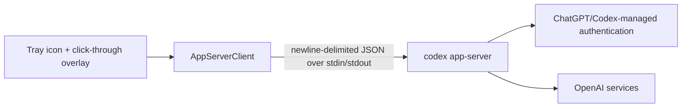

<p align="center">
  
</p>

# Codex Rate Monitor for Windows

[简体中文](README.zh-CN.md) · [繁體中文](README.zh-TW.md) · **English**

A small, native Windows tray utility that shows the current Codex 5-hour and
7-day usage windows next to ChatGPT desktop's Codex UI, plus available
rate-limit reset credits.

> [!IMPORTANT]
> Unofficial community project, not affiliated with or endorsed by OpenAI.
> The local `codex app-server` protocol may change between versions.

## Screenshots

The overlay supports 1-row and multi-row layouts. The reset-credit card in the
multi-row layout changes color as expiry approaches: normal 鈫?warning (鈮?
days) 鈫?danger tint (鈮? days), and hides itself when no credits are available.


The 1-row layout lines up the 5-hour, 7-day, and reset-credit cards
horizontally, sized for a title bar.


Hovering the tray icon shows a multi-line summary of usage and reset credits.


Appearance settings offer a live preview: position, fonts, colors, opacity,
and the reset-credits (read-only) toggle.


## Features

- Overlay with desktop-floating (topmost, draggable, click-through) and
  window-attach modes; 1-row / multi-row layouts; remaining or used display.
- Reset-credit badge: read-only display of available credits and earliest
  expiry 鈥?never redeems credits.
- Multi-line tray tooltip with usage and reset-credit summary.
- Low traffic: long-lived app-server with lightweight reads plus push
  notifications, and a reduced cadence while the desktop window is minimized
  (see "Traffic" below).
- Also: zh-CN / zh-TW / English UI, full appearance editor, start with
  Windows, background update checks with verified in-place updates.

## Requirements

- Windows 10/11, .NET Framework 4.8.
- A signed-in ChatGPT desktop app (legacy Codex App + Codex CLI still work).
  API-key login cannot show subscription usage windows.

## Install

1. Download `CodexRateMonitor-VERSION-windows-x64.zip` from
   [Releases](https://github.com/D1NOOO/codex-usage-monitor/releases) and
   optionally verify `SHA256SUMS.txt`.
2. Extract to a stable location and run `CodexRateMonitor.exe`. The app has no
   main window; look for its icon in the notification area (possibly under the
   `^` overflow). Right-click to configure, double-click for settings.

Release executables are unsigned; SmartScreen may show an unknown-publisher
warning. Download only from this repository's Releases page and verify.

## Traffic

The tool is designed to be gentle on your data plan (background:
[issue #5](https://github.com/D1NOOO/codex-usage-monitor/issues/5)):

| Scenario | Behavior |
|---|---|
| ChatGPT/Codex window visible | One lightweight read every `RefreshSeconds` (default 60s) |
| Window minimized / tray-only | Cadence drops to `MinimizedRefreshSeconds` (default 300s) |
| Reset-credit query | One read-only request every `ResetCreditsSeconds` (default 30 min) |

The app-server process stays alive and is reused for the whole session;
periodic refreshes send lightweight `account/rateLimits/read` requests and
merge `account/rateLimits/updated` push notifications instead of restarting
the process. The old scheme cold-started the CLI on every refresh, whose
initialization traffic dwarfed the lightweight reads (see issue #5).

## How it works


```mermaid
flowchart LR
    UI["Tray icon + click-through overlay"] --> Client["AppServerClient"]
    Client -->|"newline-delimited JSON over stdin/stdout"| Server["codex app-server"]
    Server --> Auth["ChatGPT/Codex-managed authentication"]
    Server --> API["OpenAI services"]
```

The monitor locates a Codex executable (desktop-bundled 鈫?npm install 鈫?PATH),
starts `codex.exe app-server`, sends `account/rateLimits/read`, renders
`primary` as the 5-hour window and `secondary` as the 7-day window, and merges
`account/rateLimits/updated` notifications.

OpenAI authentication is owned by ChatGPT/Codex. The one exception: when reset
credits are enabled, the monitor reads the access token from `~/.codex/auth.json`
locally and uses it only to query the read-only endpoint
`chatgpt.com/backend-api/wham/rate-limit-reset-credits` 鈥?the token lives in
memory for the duration of each request and is never redeemed, stored, or sent
anywhere else. Redacted diagnostic logs live under
`%LOCALAPPDATA%\CodexRateMonitor\logs` and never contain tokens or account
identifiers. Private vulnerabilities: [SECURITY.md](SECURITY.md).

## Configuration

Common `settings.json` fields (template in `config/settings.default.json`):

| Field | Description |
|---|---|
| `Language` | `auto` / `zh-CN` / `zh-TW` / `en` |
| `OverlayMode` | `desktop` (default, floating) / `attach` |
| `UsageDisplay` | `remaining` (default) / `used` |
| `RefreshSeconds` | 30鈥?00, cadence while the window is visible (default 60) |
| `MinimizedRefreshSeconds` | 60鈥?600, cadence while minimized (default 300) |
| `ShowResetCredits` | Reset-credit badge toggle (default on) |
| `ResetCreditsSeconds` | 300鈥?6400, reset-credit query interval (default 1800) |
| `DiagnosticsEnabled` / `DiagnosticRetentionDays` | Diagnostic log toggle and retention |

Appearance fields (fonts, `#RRGGBB` colors, scale, opacity) are documented in
the default template and editable in the settings UI.

## Build and release

```powershell
git clone https://github.com/D1NOOO/codex-usage-monitor.git
cd codex-usage-monitor
.\scripts\build.ps1 -Package
```

Output goes to `artifacts/`. CI runs `scripts/verify.ps1` first
(localization keys, JSON/PowerShell syntax, privacy and credential scans).
To release, bump `version.txt`, push a matching tag, and
`.github/workflows/release.yml` builds and publishes with provenance.

## FAQ

### Codex executable not found / not signed in

Open or update ChatGPT desktop first. Standalone CLI users: check
`codex --version` and `codex app-server --help`, then run `codex doctor`.
If it reports API-key auth, sign in with the ChatGPT account flow 鈥?API keys
cannot return subscription usage windows.

### The overlay is missing

Bring the ChatGPT/Codex window to the foreground (attach mode only shows while
the window is visible), confirm the tray icon is running, then use
**Refresh now**.

### Overlay position drifted after a UI update

Placement is tailored to the current desktop layout. Open an issue with a
redacted screenshot if it needs adjusting.

## Known limitations

Windows only; depends on the experimental local app-server protocol; release
binaries are not code-signed.

## License

[MIT](LICENSE). Codex and OpenAI are trademarks of their respective owner.
This project is unofficial and uses no OpenAI branding assets.
