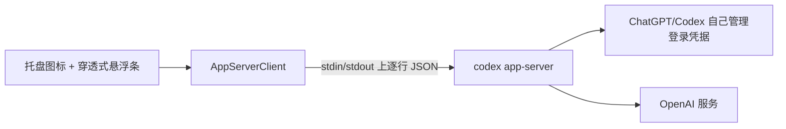

<p align="center">
  
</p>

# Codex 用量监视器（Windows）

**简体中文** · [繁體中文](README.zh-TW.md) · [English](README.md)

一个原生 Windows 托盘小工具，在 ChatGPT 桌面端的 Codex 界面旁显示当前 5 小时窗口和
7 天窗口的剩余或已用百分比及本地重置时间。

> [!IMPORTANT]
> 这是非官方社区项目，与 OpenAI 无隶属、背书或支持关系。
> `codex app-server` 属于本地/实验性协议，未来 ChatGPT 桌面端或 Codex 版本可能调整。

## 快速使用

1. 打开 ChatGPT 桌面端，完成登录，并切到你要监视的 Codex 界面。
   本工具只显示 ChatGPT 账户订阅侧的用量窗口；API Key 或 API 登录方式不会暴露 Codex
   的 5 小时 / 7 天窗口，因此无法通过本工具查看。
2. 在解压后的发布文件夹中运行 `CodexRateMonitor.exe`。程序没有主窗口，会出现在
   Windows 右下角通知区域，也可能先被收进 `^` 隐藏区域。
3. 将 ChatGPT/Codex 窗口切到前台。悬浮条只在该窗口处于前台时显示，切到其他应用时会自动隐藏。
4. 右键托盘图标。**外观设置** 是第一项，可在这里调整位置、大小、颜色、透明度、语言和用量显示模式。
5. 点击 **立即刷新** 可强制读取一次用量；选择 **顶部标题栏** 或 **右下角** 可移动悬浮条。
   双击托盘图标也会打开外观设置。

如果看起来“没启动”，请先检查托盘 `^` 隐藏区域，退出旧版监视器进程，再重新运行当前版本并把
ChatGPT/Codex 切到前台。


## 功能

- 默认显示 5 小时与 7 天窗口的剩余百分比，也可切换为显示已用。
- 进度条长度及警告/危险颜色会随显示模式同步变化。
- 支持右下角、顶部标题栏两种位置。
- 原生 GUI EXE，无 CMD、Node 或 PowerShell 包装窗口。
- 悬浮条不抢焦点，鼠标点击会穿透到 ChatGPT/Codex。
- 完整外观设置：字体、字号、缩放、透明度、圆角、颜色和浅色/深色预设。
- 支持简体中文、繁體中文、English，可自动跟随系统或手动选择。
- 可从托盘启用/取消开机启动。
- 不直接读取任何 Codex 凭据文件。

## 运行要求

- Windows 10/11
- .NET Framework 4.8
- 已安装支持 Codex 的 ChatGPT 桌面端；旧版 Codex App 仍兼容。
- 可用的原生 Codex 可执行文件。程序会优先使用正在运行的 ChatGPT 桌面端内置的
  可执行文件，然后回退到用户 PATH 中支持以下命令的独立 Codex CLI：

  ```powershell
  codex app-server
  ```

- ChatGPT/Codex 已正常登录并能返回用量窗口数据。API Key 或 API 登录方式无法提供本工具显示的
  5 小时 / 7 天 Codex 用量窗口。
- 用户本机环境很重要：该机器必须能运行 `codex app-server`，并且它能读取到与 ChatGPT
  桌面端或 Codex CLI 相同的登录状态。

## 安装与使用

1. 在仓库 **Releases** 页面下载
   `CodexRateMonitor-VERSION-windows-x64.zip`。
2. 可使用 `SHA256SUMS.txt` 校验文件。
3. 解压整个目录到固定位置。
4. 双击 `CodexRateMonitor.exe`。

程序没有主窗口，会常驻 Windows 右下角通知区域。新图标可能先被系统收入
`^` 隐藏区域。

当前发布的 EXE 未进行商业代码签名，SmartScreen 可能提示未知发布者。
请只从本仓库 Release 下载，并校验 SHA256 或 GitHub 构建来源证明。

右击托盘图标可刷新、切换位置、打开外观设置、设置开机启动或退出。
双击托盘图标直接打开外观设置。

### 语言

在 **外观设置 → 界面语言** 中选择：

- 自动（跟随系统）
- 简体中文
- 繁體中文
- English

保存后，托盘菜单、状态提示、设置窗口、悬浮条标签和日期格式都会切换。
重新打开外观设置即可看到整个窗口使用新语言。

## 实现原理



悬浮条会跟随前台的 `ChatGPT.exe` 桌面窗口，同时仍识别旧版 `Codex.exe` 窗口。
用量数据不是来自截图、OCR 或 ChatGPT UI 内部接口，而是来自本机 Codex CLI 的 app-server
协议。

程序会按以下顺序寻找可运行的 Codex 命令：

1. ChatGPT 桌面端内置的 `resources\codex.exe`，前提是 Windows 允许外部进程直接执行它。
2. npm/global 安装的 Codex CLI 内部原生可执行文件。
3. 用户 PATH 中的 `codex.exe`、`codex.cmd` 或 `codex.ps1`。

然后直接启动：

```text
codex.exe app-server
```

初始化完成后发送：

```json
{"method":"account/rateLimits/read","id":11}
```

响应包含 `usedPercent`、`windowDurationMins`、`resetsAt` 等字段。
程序把 `primary` 渲染为 5 小时窗口，把 `secondary` 渲染为 7 天窗口；
同时合并 `account/rateLimits/updated` 的稀疏更新。

登录、令牌刷新和与 OpenAI 的网络通信全部由 ChatGPT/Codex 负责，本工具不实现认证。

## 隐私与安全

本工具会：

- 仅通过重定向标准输入/输出与子进程 `codex app-server` 通信；
- 在内存里暂存当前用量用于显示；
- 在 `settings.json` 保存显示和诊断偏好；
- 在 `%LOCALAPPDATA%\CodexRateMonitor\logs` 写入脱敏诊断日志，并自动清理过期文件；
- 用户选择开机启动时，在
  `HKCU\Software\Microsoft\Windows\CurrentVersion\Run` 写入一项。

本工具不会：

- 打开、解析、复制、上传或打印 `auth.json`；
- 保存访问令牌或账户标识；
- 加入遥测或统计；
- 要求 OpenAI API Key；
- 把用量发给开发者控制的服务器。

提交 Issue 时，请勿上传 `auth.json`、令牌、账户信息或未经脱敏的桌面截图。
安全问题请按 [SECURITY.md](SECURITY.md) 私下报告。
仓库公开前，请维护者逐项检查 [PUBLISHING.md](PUBLISHING.md)。

## 配置

Release 中的 `settings.json` 来自隐私安全的
`config/settings.default.json`。它包含显示和诊断偏好：

| 字段 | 可选值 |
|---|---|
| `Language` | `auto`、`zh-CN`、`zh-TW`、`en` |
| `Position` | `top`（默认）、`bottom-right`（旧的 `bottom-left` 会自动迁移） |
| `UsageDisplay` | `remaining`（默认）、`used` |
| `RefreshSeconds` | 30–900 |
| `DiagnosticsEnabled` | `true`（默认）、`false` |
| `DiagnosticRetentionDays` | 1–30（默认 7） |
| `Style.Scale` | 0.75–1.50 |
| `Style.Opacity` | 0.50–1.00 |
| `Style.FontSize` | 10–22 |
| `Style.ResetFontSize` | 9–18 |

颜色使用 `#RRGGBB` 或 `#RRGGBBAA`。个人运行产生的 `settings.json`
已被 `.gitignore` 排除，仓库只提交默认模板。

诊断日志只记录时间、请求/通知类型、原始限额百分比、窗口长度、重置时间、
解析结果和脱敏错误分类；不会记录完整 app-server 消息、令牌、账户标识或认证文件。
程序启动时会清理一次，运行期间最多每小时清理一次。

## 从源码构建

```powershell
git clone https://github.com/D1NOOO/codex-usage-monitor.git
cd codex-usage-monitor
.\scripts\build.ps1 -Package
```

构建脚本使用 Windows/Visual Studio 自带的 .NET Framework 4.8 编译器，
不下载 NuGet 依赖。输出位于 `artifacts/`。CI 会先运行
`scripts/verify.ps1`，检查三语言键、JSON/PowerShell 语法、误提交的个人
设置、个人路径和常见凭据格式。

## GitHub Actions 自动发布

1. 更新 `version.txt` 并提交。
2. 创建同版本标签：

   ```powershell
   git tag v0.1.0
   git push origin main
   git push origin v0.1.0
   ```

3. Release 工作流会自动：
   - 检查标签和 `version.txt` 一致；
   - 在 `windows-latest` 上编译；
   - 生成 ZIP 和 `SHA256SUMS.txt`；
   - 生成 GitHub 构建来源证明；
   - 创建 Release 和自动发布说明。

工作流只使用仓库范围的 `GITHUB_TOKEN`，不需要个人 PAT。发布任务仅授予
`contents: write`、`id-token: write`、`attestations: write`。
所有官方 Action 都固定到完整 Commit SHA，并由 Dependabot 每周检查更新。

验证构建来源：

```powershell
gh attestation verify CodexRateMonitor-VERSION-windows-x64.zip `
  --repo D1NOOO/codex-usage-monitor
```

## 常见问题

### 提示找不到 Codex 可执行文件

请先打开或更新 ChatGPT 桌面端。如果你使用独立 CLI，请打开新的 PowerShell 窗口检查：

```powershell
codex --version
codex app-server --help
```

如果 ChatGPT 桌面端没有提供内置可执行文件，且第二条命令不可用，请更新/安装 Codex CLI。

`codex app-server --help` 只能证明命令存在，并不会读取用量。排查登录状态请运行：

```powershell
codex doctor
```

如果 Doctor 显示 `stored auth mode api_key`，或没有 stored ChatGPT tokens，CLI 就无法读取
ChatGPT/Codex 的 5 小时 / 7 天用量窗口。请先在 Codex CLI 或 ChatGPT 桌面端完成 ChatGPT
账户登录，然后重试。

### 提示未登录

请在 ChatGPT 桌面端的 Codex 界面或 CLI 正常登录。本工具不会接触或代管凭据。

如果悬浮条提示需要 ChatGPT 账户登录，说明 app-server 已经启动，但当前 Codex CLI 是 API Key
登录态。API Key 可以用于模型调用，但不能返回 ChatGPT/Codex 订阅用量窗口。

### 悬浮条不显示

将 ChatGPT/Codex 窗口切到前台；确认托盘图标仍在；重新选择位置并点击“立即刷新”。

## 已知限制

- 仅支持 Windows。
- 依赖 Codex 本地实验性 app-server 协议。
- 位置偏移适配当前 ChatGPT 桌面端 Codex 布局和旧版 Codex 桌面布局，UI 更新后可能需要调整。
- Release EXE 尚未代码签名。
- 用量窗口的可用性和含义由 Codex/OpenAI 决定。

## 贡献与许可证

参阅 [CONTRIBUTING.md](CONTRIBUTING.md)。所有可见字符串必须同时维护
简中、繁中和英文；严禁提交凭据、个人路径、真实运行设置或隐私截图。

许可证：[MIT](LICENSE)

Codex 和 OpenAI 是其权利人的商标。本项目为非官方项目，不使用 OpenAI
品牌资产。
