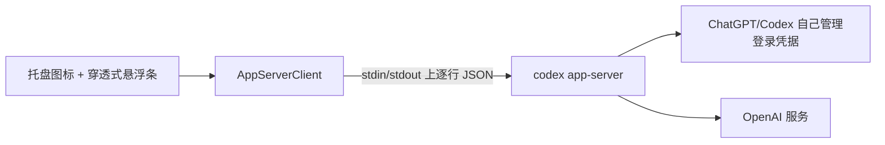

<p align="center">
  
</p>

# Codex 用量监视器（Windows）

**简体中文** · [繁體中文](README.zh-TW.md) · [English](README.md)

一个原生 Windows 托盘小工具，在 ChatGPT 桌面端的 Codex 界面旁显示当前 5 小时与
7 天用量窗口，并展示可用的限额重置券。

> [!IMPORTANT]
> 非官方社区项目，与 OpenAI 无隶属关系。`codex app-server` 是本地实验性协议，
> 未来版本可能调整。

## 界面截图

悬浮条支持 1 行与多行两种布局。多行布局中的重置券卡片会按到期时间分级变色：
正常 → 警告（≤7 天）→ 危险染色（≤3 天），无券时自动隐藏。


1 行布局把 5 小时、7 天与重置券卡片横向排成一行，适合嵌入标题栏。


鼠标悬停托盘图标可查看分行显示的用量与重置券摘要。


外观设置提供实时预览：位置、字体、颜色、透明度，以及「显示重置券（只读查询）」开关。


## 功能

- 悬浮条支持桌面悬浮（置顶、可拖拽、点击穿透）与窗口吸附两种模式，
  1 行 / 多行两种布局，剩余 / 已用两种显示口径。
- 重置券卡片：只读展示可用数量与最早到期时间，绝不调用核销接口。
- 托盘悬浮提示分行显示用量与重置券摘要。
- 流量极低：app-server 常驻，周期刷新只用轻量请求 + 推送合并，
  窗口最小化时自动降频（见下文「流量消耗」）。
- 其余：三语界面（简中 / 繁中 / 英文）、完整外观编辑、开机启动、
  后台更新检测与校验式原地更新。

## 运行要求

- Windows 10/11，.NET Framework 4.8。
- 已登录的 ChatGPT 桌面端（旧版 Codex App + Codex CLI 仍兼容）。
  API Key 登录无法显示订阅用量窗口。

## 安装

1. 从 [Releases](https://github.com/D1NOOO/codex-usage-monitor/releases) 下载
   `CodexRateMonitor-VERSION-windows-x64.zip`，按需校验 `SHA256SUMS.txt`。
2. 解压到固定位置，运行 `CodexRateMonitor.exe`。程序无主窗口，常驻通知区域
   （可能先被收进 `^` 隐藏区）。右键托盘图标配置，双击打开外观设置。

EXE 未做商业签名，SmartScreen 可能提示未知发布者；请只从 Releases 下载并校验。

## 流量消耗

程序专门为低流量设计（背景见
[issue #5](https://github.com/D1NOOO/codex-usage-monitor/issues/5)）：

| 场景 | 行为 |
|---|---|
| ChatGPT/Codex 窗口可见 | 每 `RefreshSeconds`（默认 60s）一次轻量读取 |
| 窗口最小化 / 仅托盘 | 降频到 `MinimizedRefreshSeconds`（默认 300s） |
| 重置券查询 | 每 `ResetCreditsSeconds`（默认 30 分钟）一次只读请求 |

app-server 进程全程常驻复用：周期刷新只发送轻量 `account/rateLimits/read` 请求并合并
`account/rateLimits/updated` 推送，不按固定周期重启进程。旧方案每次刷新都要冷启动
CLI，其初始化流量是轻量读取的数千倍（详见 issue #5）。

## 实现原理


```mermaid
flowchart LR
    UI["托盘图标 + 穿透式悬浮条"] --> Client["AppServerClient"]
    Client -->|"stdin/stdout 上逐行 JSON"| Server["codex app-server"]
    Server --> Auth["ChatGPT/Codex 自己管理登录凭据"]
    Server --> API["OpenAI 服务"]
```

程序按「桌面端内置 → npm 安装 → PATH」的顺序寻找 Codex 可执行文件，启动
`codex.exe app-server`，发送 `account/rateLimits/read`，将 `primary` 渲染为 5 小时窗口、
`secondary` 为 7 天窗口，并合并 `account/rateLimits/updated` 推送。

登录、令牌刷新和与 OpenAI 的通信全部由 ChatGPT/Codex 负责，本工具不实现认证。
唯一例外：启用重置券时，程序本地读取 `~/.codex/auth.json` 的访问令牌，仅用于查询只读接口
`chatgpt.com/backend-api/wham/rate-limit-reset-credits`——令牌只在单次请求期间存于内存，
绝不核销、不存储、不外传。诊断日志写入 `%LOCALAPPDATA%\CodexRateMonitor\logs`
并自动清理，不含令牌与账户信息。安全问题请按 [SECURITY.md](SECURITY.md) 私下报告。

## 配置

`settings.json`（来自 `config/settings.default.json`）常用字段：

| 字段                                               | 说明                                 |
| ------------------------------------------------ | ---------------------------------- |
| `Language`                                       | `auto` / `zh-CN` / `zh-TW` / `en`  |
| `OverlayMode`                                    | `desktop`（默认，桌面悬浮）/ `attach`（吸附窗口） |
| `UsageDisplay`                                   | `remaining`（默认）/ `used`            |
| `RefreshSeconds`                                 | 30–900，窗口可见时的刷新间隔（默认 60）           |
| `MinimizedRefreshSeconds`                        | 60–3600，最小化时的刷新间隔（默认 300）          |
| `ShowResetCredits`                               | 重置券卡片开关（默认开）                       |
| `ResetCreditsSeconds`                            | 300–86400，重置券查询间隔（默认 1800）         |
| `DiagnosticsEnabled` / `DiagnosticRetentionDays` | 诊断日志开关与保留天数                        |

其余外观字段（字体、颜色 `#RRGGBB`、缩放、透明度等）见默认模板或外观设置界面。

## 构建与发布

```powershell
git clone https://github.com/D1NOOO/codex-usage-monitor.git
cd codex-usage-monitor
.\scripts\build.ps1 -Package
```

输出位于 `artifacts/`。CI 先运行 `scripts/verify.ps1`（三语键、JSON/PowerShell 语法、
隐私与凭据扫描）。发布时更新 `version.txt`、推送同名 tag，
`.github/workflows/release.yml` 自动构建并创建带来源证明的 Release。

## FAQ

### 找不到 Codex 可执行文件 / 未登录

先打开或更新 ChatGPT 桌面端；独立 CLI 用户用 `codex --version` 与
`codex app-server --help` 确认可用，`codex doctor` 排查登录。若为 API Key 登录态，
请改用 ChatGPT 账户登录——API Key 无法返回订阅用量窗口。

### 悬浮条不显示

把 ChatGPT/Codex 窗口切到前台（吸附模式只在窗口可见时显示）；确认托盘图标在运行；
必要时点击「立即刷新」。

### UI 更新后位置偏了

位置偏移适配当前桌面端布局，界面更新后可能需要调整。欢迎提交带脱敏截图的 issue。

## 已知限制

仅支持 Windows；依赖本地实验性 app-server 协议；Release EXE 未做代码签名。

## 许可证

[MIT](LICENSE)。Codex 和 OpenAI 是其权利人的商标，本项目为非官方项目。
