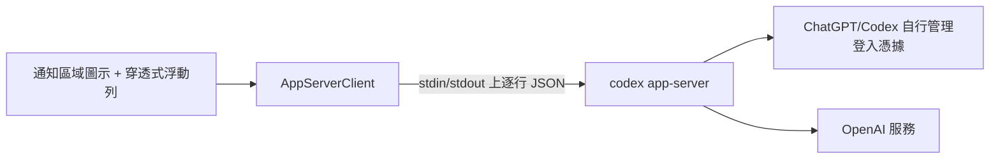

<p align="center">
  
</p>

# Codex 用量監視器（Windows）

[简体中文](README.zh-CN.md) · **繁體中文** · [English](README.md)

一個原生 Windows 通知區域小工具，在 ChatGPT 桌面版的 Codex 介面旁顯示目前 5 小時視窗與
7 天視窗的剩餘或已用百分比及本機重設時間。

> [!IMPORTANT]
> 這是非官方社群專案，與 OpenAI 無隸屬、背書或支援關係。
> `codex app-server` 是本機／實驗性協定，未來 ChatGPT 桌面版或 Codex 版本可能調整。

## 快速使用

1. 開啟 ChatGPT 桌面版，完成登入，並切到你要監視的 Codex 介面。
   本工具只顯示 ChatGPT 帳戶訂閱側的用量視窗；API Key 或 API 登入方式不會暴露 Codex
   的 5 小時 / 7 天視窗，因此無法透過本工具查看。
2. 在解壓縮後的發布資料夾中執行 `CodexRateMonitor.exe`。程式沒有主視窗，會出現在
   Windows 右下角通知區域，也可能先被收進 `^` 隱藏區域。
3. 將 ChatGPT/Codex 視窗切到前景。浮動列只會在該視窗位於前景時顯示，切到其他應用程式時會自動隱藏。
4. 右鍵通知區域圖示。**外觀設定** 是第一項，可在這裡調整位置、大小、顏色、透明度、語言和用量顯示模式。
5. 點擊 **立即重新整理** 可強制讀取一次用量；選擇 **頂部標題列** 或 **左下角頭像右側** 可移動浮動列。
   雙擊通知區域圖示也會開啟外觀設定。

如果看起來「沒有啟動」，請先檢查通知區域的 `^` 隱藏區域，退出舊版監視器程序，再重新執行目前版本並把
ChatGPT/Codex 切到前景。


## 功能

- 預設顯示 5 小時與 7 天視窗的剩餘百分比，也可切換為顯示已用。
- 進度列長度及警告／危險顏色會隨顯示模式同步變化。
- 支援左下角頭像右側、頂部標題列兩種位置。
- 原生 GUI EXE，沒有 CMD、Node 或 PowerShell 包裝視窗。
- 浮動列不搶焦點，滑鼠點擊會穿透到 ChatGPT/Codex。
- 完整外觀設定：字型、字級、縮放、透明度、圓角、顏色及淺色／深色預設。
- 支援简体中文、繁體中文、English，可自動跟隨系統或手動選擇。
- 可從通知區域啟用或停用開機啟動。
- 不直接讀取任何 Codex 憑據檔案。

## 執行需求

- Windows 10/11
- .NET Framework 4.8
- 已安裝支援 Codex 的 ChatGPT 桌面版；舊版 Codex App 仍相容。
- 可用的原生 Codex 執行檔。程式會優先使用正在執行的 ChatGPT 桌面版內建執行檔，
  然後回退到使用者 PATH 中支援下列命令的獨立 Codex CLI：

  ```powershell
  codex app-server
  ```

- ChatGPT/Codex 已正常登入，且能傳回用量視窗資料。API Key 或 API 登入方式無法提供本工具顯示的
  5 小時 / 7 天 Codex 用量視窗。
- 使用者本機環境很重要：該機器必須能執行 `codex app-server`，而且它能讀取到與 ChatGPT
  桌面版或 Codex CLI 相同的登入狀態。

## 安裝與使用

1. 在倉庫 **Releases** 頁面下載
   `CodexRateMonitor-VERSION-windows-x64.zip`。
2. 可使用 `SHA256SUMS.txt` 驗證檔案。
3. 將整個目錄解壓縮到固定位置。
4. 雙擊 `CodexRateMonitor.exe`。

程式沒有主視窗，會常駐 Windows 右下角通知區域。新圖示可能先被系統收入
`^` 隱藏區域。

目前發佈的 EXE 未進行商業程式碼簽章，SmartScreen 可能提示未知發行者。
請只從本倉庫 Release 下載，並驗證 SHA256 或 GitHub 建置來源證明。

右擊通知區域圖示可重新整理、切換位置、開啟外觀設定、設定開機啟動或結束。
雙擊圖示可直接開啟外觀設定。

### 語言

在 **外觀設定 → 介面語言** 中選擇：

- 自動（跟隨系統）
- 简体中文
- 繁體中文
- English

儲存後，通知區域選單、狀態提示、設定視窗、浮動列標籤及日期格式都會切換。
重新開啟外觀設定即可看到整個視窗使用新語言。

## 實作原理



浮動列會跟隨前景的 `ChatGPT.exe` 桌面視窗，同時仍識別舊版 `Codex.exe` 視窗。
用量資料不是來自截圖、OCR 或 ChatGPT UI 內部介面，而是來自本機 Codex CLI 的 app-server
協定。

程式會依下列順序尋找可執行的 Codex 命令：

1. ChatGPT 桌面版內建的 `resources\codex.exe`，前提是 Windows 允許外部程序直接執行它。
2. npm/global 安裝的 Codex CLI 內部原生執行檔。
3. 使用者 PATH 中的 `codex.exe`、`codex.cmd` 或 `codex.ps1`。

然後直接啟動：

```text
codex.exe app-server
```

初始化完成後傳送：

```json
{"method":"account/rateLimits/read","id":11}
```

回應包含 `usedPercent`、`windowDurationMins`、`resetsAt` 等欄位。
程式將 `primary` 呈現為 5 小時視窗，將 `secondary` 呈現為 7 天視窗；
同時合併 `account/rateLimits/updated` 的稀疏更新。

登入、權杖更新及與 OpenAI 的網路通訊全部由 ChatGPT/Codex 負責，本工具不實作驗證。

## 隱私與安全

本工具會：

- 僅透過重新導向的標準輸入／輸出與子程序 `codex app-server` 通訊；
- 在記憶體暫存目前用量以供顯示；
- 在 `settings.json` 儲存顯示偏好；
- 使用者選擇開機啟動時，在
  `HKCU\Software\Microsoft\Windows\CurrentVersion\Run` 寫入一個項目。

本工具不會：

- 開啟、解析、複製、上傳或列印 `auth.json`；
- 儲存存取權杖、帳戶識別碼或歷史用量；
- 寫入應用程式日誌；
- 加入遙測或統計；
- 要求 OpenAI API Key；
- 將用量傳送到開發者控制的伺服器。

提交 Issue 時，請勿上傳 `auth.json`、權杖、帳戶資訊或未去識別化的桌面截圖。
安全問題請依 [SECURITY.md](SECURITY.md) 私下回報。
倉庫公開前，維護者請逐項檢查 [PUBLISHING.md](PUBLISHING.md)。

## 設定

Release 中的 `settings.json` 來自隱私安全的
`config/settings.default.json`，只包含顯示偏好：

| 欄位 | 可選值 |
|---|---|
| `Language` | `auto`、`zh-CN`、`zh-TW`、`en` |
| `Position` | `bottom-left`、`top` |
| `UsageDisplay` | `remaining`（預設）、`used` |
| `RefreshSeconds` | 30–900 |
| `Style.Scale` | 0.75–1.50 |
| `Style.Opacity` | 0.50–1.00 |
| `Style.FontSize` | 10–22 |
| `Style.ResetFontSize` | 9–18 |

顏色使用 `#RRGGBB` 或 `#RRGGBBAA`。個人執行產生的 `settings.json`
已由 `.gitignore` 排除，倉庫只提交預設範本。

## 從原始碼建置

```powershell
git clone https://github.com/D1NOOO/codex-usage-monitor.git
cd codex-usage-monitor
.\scripts\build.ps1 -Package
```

建置指令碼使用 Windows／Visual Studio 內建的 .NET Framework 4.8 編譯器，
不下載 NuGet 相依套件。輸出位於 `artifacts/`。CI 會先執行
`scripts/verify.ps1`，檢查三語言鍵、JSON／PowerShell 語法，以及誤提交的
個人設定、個人路徑和常見憑據格式。

## GitHub Actions 自動發佈

1. 更新 `version.txt` 並提交。
2. 建立相同版本的標籤：

   ```powershell
   git tag v0.1.0
   git push origin main
   git push origin v0.1.0
   ```

3. Release 工作流程會自動：
   - 檢查標籤與 `version.txt` 一致；
   - 在 `windows-latest` 上編譯；
   - 產生 ZIP 及 `SHA256SUMS.txt`；
   - 產生 GitHub 建置來源證明；
   - 建立 Release 及自動發佈說明。

工作流程只使用倉庫範圍的 `GITHUB_TOKEN`，不需要個人 PAT。發佈工作只授予
`contents: write`、`id-token: write`、`attestations: write`。
所有官方 Action 都固定到完整 Commit SHA，並由 Dependabot 每週檢查更新。

驗證建置來源：

```powershell
gh attestation verify CodexRateMonitor-VERSION-windows-x64.zip `
  --repo D1NOOO/codex-usage-monitor
```

## 常見問題

### 提示找不到 Codex 執行檔

請先開啟或更新 ChatGPT 桌面版。如果你使用獨立 CLI，請開啟新的 PowerShell 視窗檢查：

```powershell
codex --version
codex app-server --help
```

如果 ChatGPT 桌面版沒有提供內建執行檔，且第二個命令無法使用，請更新或安裝 Codex CLI。

`codex app-server --help` 只能證明命令存在，並不會讀取用量。排查登入狀態請執行：

```powershell
codex doctor
```

如果 Doctor 顯示 `stored auth mode api_key`，或沒有 stored ChatGPT tokens，CLI 就無法讀取
ChatGPT/Codex 的 5 小時 / 7 天用量視窗。請先在 Codex CLI 或 ChatGPT 桌面版完成 ChatGPT
帳戶登入，然後重試。

### 提示尚未登入

請在 ChatGPT 桌面版的 Codex 介面或 CLI 正常登入。本工具不會接觸或代管憑據。

如果浮動列提示需要 ChatGPT 帳戶登入，表示 app-server 已經啟動，但目前 Codex CLI 是 API Key
登入狀態。API Key 可以用於模型呼叫，但不能返回 ChatGPT/Codex 訂閱用量視窗。

### 浮動列沒有顯示

將 ChatGPT/Codex 視窗切到前景；確認通知區域圖示仍在；重新選擇位置並點擊「立即重新整理」。

## 已知限制

- 僅支援 Windows。
- 依賴 Codex 本機實驗性 app-server 協定。
- 位置偏移配合目前 ChatGPT 桌面版 Codex 配置和舊版 Codex 桌面版配置，UI 更新後可能需要調整。
- Release EXE 尚未進行程式碼簽章。
- 用量視窗的可用性和含義由 Codex／OpenAI 決定。

## 貢獻與授權

請參閱 [CONTRIBUTING.md](CONTRIBUTING.md)。所有可見字串必須同時維護
簡中、繁中及英文；嚴禁提交憑據、個人路徑、真實執行設定或隱私截圖。

授權：[MIT](LICENSE)

Codex 和 OpenAI 是其權利人的商標。本專案為非官方專案，不使用 OpenAI
品牌資產。
