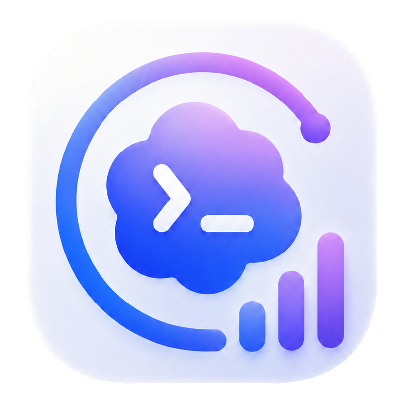
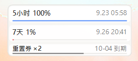
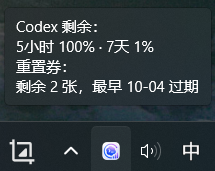
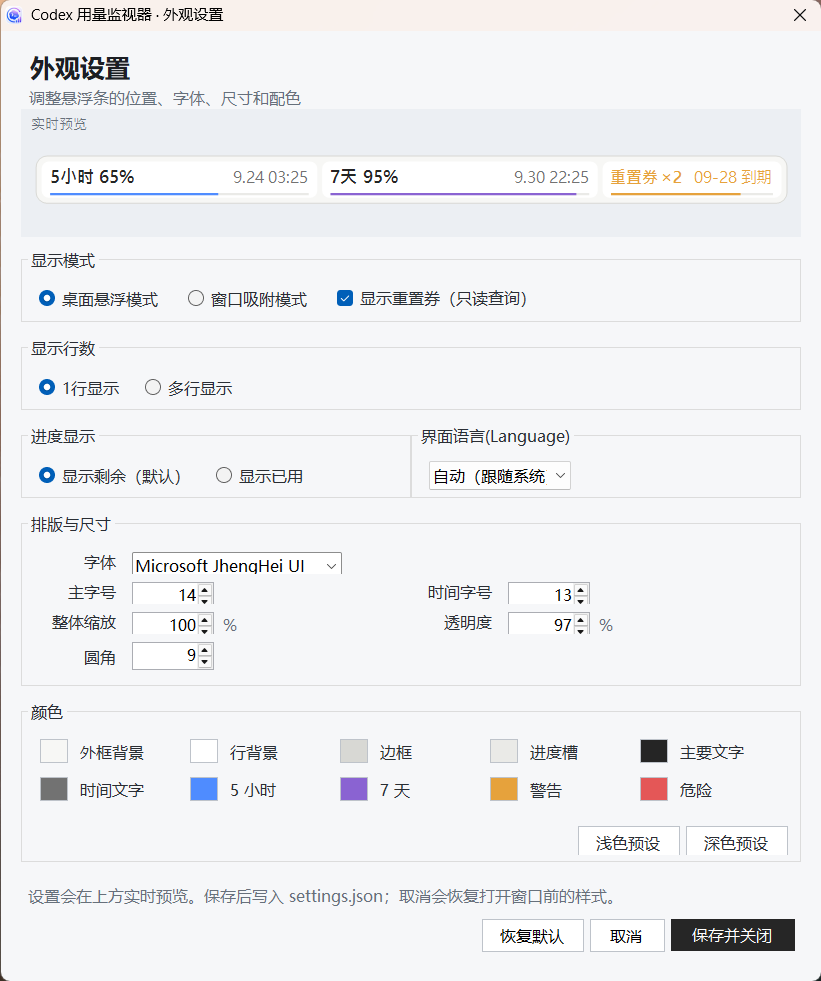
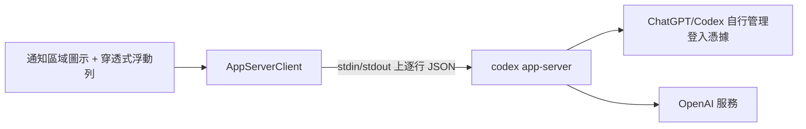

<p align="center">
  
</p>

# Codex 用量監視器（Windows）

[简体中文](README.zh-CN.md) · **繁體中文** · [English](README.md)

一個原生 Windows 通知區域小工具，在 ChatGPT 桌面版的 Codex 介面旁顯示目前 5 小時與
7 天用量視窗，並展示可用的限額重置券。

> [!IMPORTANT]
> 非官方社群專案，與 OpenAI 無隸屬關係。`codex app-server` 是本機實驗性協定，
> 未來版本可能調整。

## 介面截圖

浮動列支援 1 行與多行兩種版面。多行版面中的重置券卡片會依到期時間分級變色：
正常 → 警告（≤7 天）→ 危險染色（≤3 天），無券時自動隱藏。



1 行版面把 5 小時、7 天與重置券卡片橫向排成一行，適合嵌入標題列。


滑鼠懸停通知區域圖示可查看分行顯示的用量與重置券摘要。



外觀設定提供即時預覽：位置、字型、顏色、透明度，以及「顯示重置券（唯讀查詢）」開關。



## 功能

- 浮動列支援桌面懸浮（置頂、可拖曳、點擊穿透）與視窗吸附兩種模式，
  1 行 / 多行兩種版面，剩餘 / 已用兩種顯示口徑。
- 重置券卡片：唯讀顯示可用數量與最早到期時間，絕不呼叫核銷介面。
- 通知區域浮動提示分行顯示用量與重置券摘要。
- 流量極低：app-server 常駐，週期重新整理只用輕量請求 + 推送合併，
  視窗最小化時自動降頻（見下文「流量消耗」）。
- 其餘：三語介面（簡中 / 繁中 / 英文）、完整外觀編輯、開機啟動、
  背景更新檢查與校驗式原地更新。

## 執行需求

- Windows 10/11，.NET Framework 4.8。
- 已登入的 ChatGPT 桌面版（舊版 Codex App + Codex CLI 仍相容）。
  API Key 登入無法顯示訂閱用量視窗。

## 安裝

1. 從 [Releases](https://github.com/D1NOOO/codex-usage-monitor/releases) 下載
   `CodexRateMonitor-VERSION-windows-x64.zip`，按需驗證 `SHA256SUMS.txt`。
2. 解壓縮到固定位置，執行 `CodexRateMonitor.exe`。程式沒有主視窗，會常駐通知區域
   （可能先被收進 `^` 隱藏區域）。右鍵圖示設定，雙擊開啟外觀設定。

EXE 未做商業簽章，SmartScreen 可能提示未知發行者；請只從 Releases 下載並驗證。

## 流量消耗

程式專門為低流量設計（背景見
[issue #5](https://github.com/D1NOOO/codex-usage-monitor/issues/5)）：

| 情境 | 行為 |
|---|---|
| ChatGPT/Codex 視窗可見 | 每 `RefreshSeconds`（預設 60s）一次輕量讀取 |
| 視窗最小化 / 僅通知區域 | 降頻到 `MinimizedRefreshSeconds`（預設 300s） |
| 重置券查詢 | 每 `ResetCreditsSeconds`（預設 30 分鐘）一次唯讀請求 |

app-server 程序全程常駐複用：週期重新整理只傳送輕量 `account/rateLimits/read` 請求並合併
`account/rateLimits/updated` 推送，不按固定週期重啟程序。舊方案每次重新整理都要冷啟動
CLI，其初始化流量是輕量讀取的數千倍（詳見 issue #5）。

## 實作原理


```mermaid
flowchart LR
    UI["通知區域圖示 + 穿透式浮動列"] --> Client["AppServerClient"]
    Client -->|"stdin/stdout 上逐行 JSON"| Server["codex app-server"]
    Server --> Auth["ChatGPT/Codex 自行管理登入憑據"]
    Server --> API["OpenAI 服務"]
```

程式按「桌面版內建 → npm 安裝 → PATH」的順序尋找 Codex 執行檔，啟動
`codex.exe app-server`，傳送 `account/rateLimits/read`，將 `primary` 呈現為 5 小時視窗、
`secondary` 為 7 天視窗，並合併 `account/rateLimits/updated` 推送。

登入、權杖更新及與 OpenAI 的通訊全部由 ChatGPT/Codex 負責，本工具不實作驗證。
唯一例外：啟用重置券時，程式本機讀取 `~/.codex/auth.json` 的存取權杖，僅用於查詢唯讀端點
`chatgpt.com/backend-api/wham/rate-limit-reset-credits`——權杖只在單次請求期間存於記憶體，
絕不核銷、不儲存、不外傳。診斷日誌寫入 `%LOCALAPPDATA%\CodexRateMonitor\logs`
並自動清理，不含權杖與帳戶資訊。安全問題請依 [SECURITY.md](SECURITY.md) 私下回報。

## 設定

`settings.json`（來自 `config/settings.default.json`）常用欄位：

| 欄位 | 說明 |
|---|---|
| `Language` | `auto` / `zh-CN` / `zh-TW` / `en` |
| `OverlayMode` | `desktop`（預設，桌面懸浮）/ `attach`（吸附視窗） |
| `UsageDisplay` | `remaining`（預設）/ `used` |
| `RefreshSeconds` | 30–900，視窗可見時的重新整理間隔（預設 60） |
| `MinimizedRefreshSeconds` | 60–3600，最小化時的重新整理間隔（預設 300） |
| `ShowResetCredits` | 重置券卡片開關（預設開） |
| `ResetCreditsSeconds` | 300–86400，重置券查詢間隔（預設 1800） |
| `DiagnosticsEnabled` / `DiagnosticRetentionDays` | 診斷日誌開關與保留天數 |

其餘外觀欄位（字型、顏色 `#RRGGBB`、縮放、透明度等）見預設範本或外觀設定介面。

## 建置與發佈

```powershell
git clone https://github.com/D1NOOO/codex-usage-monitor.git
cd codex-usage-monitor
.\scripts\build.ps1 -Package
```

輸出位於 `artifacts/`。CI 先執行 `scripts/verify.ps1`（三語鍵、JSON/PowerShell 語法、
隱私與憑據掃描）。發佈時更新 `version.txt`、推送同名標籤，
`.github/workflows/release.yml` 自動建置並建立帶來源證明的 Release。

## FAQ

### 找不到 Codex 執行檔 / 未登入

先開啟或更新 ChatGPT 桌面版；獨立 CLI 使用者用 `codex --version` 與
`codex app-server --help` 確認可用，`codex doctor` 排查登入。若為 API Key 登入狀態，
請改用 ChatGPT 帳戶登入——API Key 無法返回訂閱用量視窗。

### 浮動列沒有顯示

把 ChatGPT/Codex 視窗切到前景（吸附模式只在視窗可見時顯示）；確認通知區域圖示在執行；
必要時點擊「立即重新整理」。

### UI 更新後位置偏了

位置偏移配合目前桌面版版面，介面更新後可能需要調整。歡迎提交帶去識別化截圖的 issue。

## 已知限制

僅支援 Windows；依賴本機實驗性 app-server 協定；Release EXE 未做程式碼簽章。

## 授權

[MIT](LICENSE)。Codex 和 OpenAI 是其權利人的商標，本專案為非官方專案。
